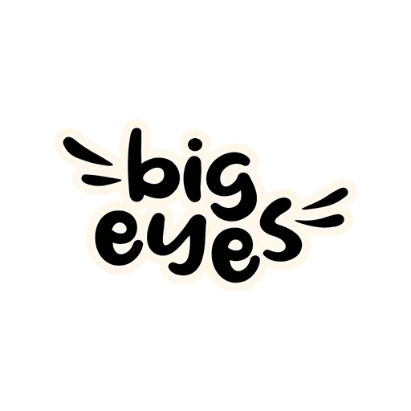

<div align="center">
  <h4>Web page: <a href="https://bigeyes-tracker.netlify.app/">https://bigeyes-tracker.netlify.app/</a></h4>
  
  <h1>Big Eyes Unofficial Event Tracker</h1>
  
  <p>
    A usefult event tracker for the <a href="https://bigeyes.space/">
   Big Eyes
  </a> project.
  </p>
  
  
<!-- Badges -->
<p>
  <a href="https://github.com/Kais3rP/big-eyes-event-tracker/graphs/contributors">
    
  </a>
  <a href="">
    
  </a>
  <a href="https://github.com/Kais3rP/big-eyes-event-tracker/network/members">
    
  </a>
  <a href="https://github.com/Kais3rP/big-eyes-event-tracker/stargazers">
    
  </a>
  <a href="https://github.com/Kais3rP/big-eyes-event-tracker/issues/">
    
  </a>
  <a href="https://github.com/Kais3rP/big-eyes-event-tracker/blob/master/LICENSE">
    
  </a>
</p>
   
<h4>
    <a href="https://github.com/Kais3rP/big-eyes-event-tracker/issues/">Report Bug</a>
  <span> · </span>
    <a href="https://github.com/Kais3rP/big-eyes-event-tracker/issues/">Request Feature</a>
  </h4>
</div>

<br />

<!-- Table of Contents -->

# :notebook_with_decorative_cover: Table of Contents

- [About the Project](#star2-about-the-project)
  - [Tech Stack](#space_invader-tech-stack)
  - [Features](#dart-features)
- [Getting Started](#toolbox-getting-started)
  - [Prerequisites](#bangbang-prerequisites)
  - [Installation](#gear-installation)
  - [Running Tests](#test_tube-running-tests)
  - [Run Locally](#running-run-locally)
- [Usage](#eyes-usage)
- [Contributing](#wave-contributing)
  - [Code of Conduct](#scroll-code-of-conduct)
- [FAQ](#grey_question-faq)
- [License](#warning-license)
- [Contact](#handshake-contact)

<!-- About the Project -->

## :star2: About the Project

<!-- TechStack -->

### :space_invader: Tech Stack

<details>
  <summary>Client</summary>
  <ul>
    <li><a href="https://reactjs.org/">React.js</a></li>
  </ul>
</details>

<!-- Features -->

### :dart: Features

- Feature 1
- Feature 2
- Feature 3

<!-- Getting Started -->

## :toolbox: Getting Started

<!-- Prerequisites -->

### :bangbang: Prerequisites

This project uses Yarn as package manager

```bash
 npm install --global yarn
```

<!-- Installation -->

### :gear: Installation

Install my-project with npm

```bash
  yarn install my-project
  cd my-project
```

<!-- Running Tests -->

### :test_tube: Running Tests

To run tests, run the following command

```bash
  yarn test test
```

<!-- Run Locally -->

### :running: Run Locally

Clone the project

```bash
  git clone https://github.com/Kais3rP/big-eyes-event-tracker.git
```

Go to the project directory

```bash
  cd my-project
```

Install dependencies

```bash
  yarn install
```

Start the server

```bash
  yarn start
```

<!-- Contributing -->

## :wave: Contributing

<a href="https://github.com/Kais3rP/big-eyes-event-tracker/graphs/contributors">
  
</a>

Contributions are always welcome!

See `CONTRIBUTING.md` for ways to get started.

<!-- Code of Conduct -->

### :scroll: Code of Conduct

Please read the [Code of Conduct](https://github.com/Kais3rP/big-eyes-event-tracker/blob/master/CODE_OF_CONDUCT.md)

<!-- FAQ -->

## :grey_question: FAQ

- Question 1

  - Answer 1

- Question 2

  - Answer 2

<!-- License -->

## :warning: License

Distributed under the no License. See LICENSE.txt for more information.
